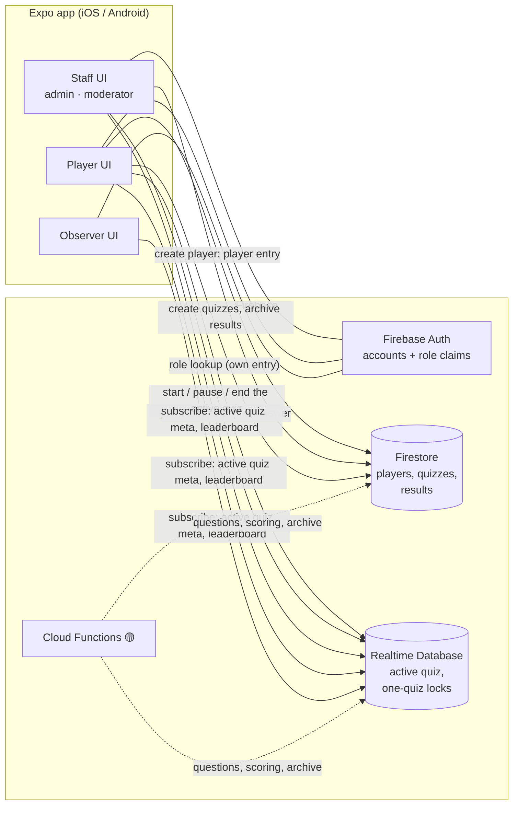
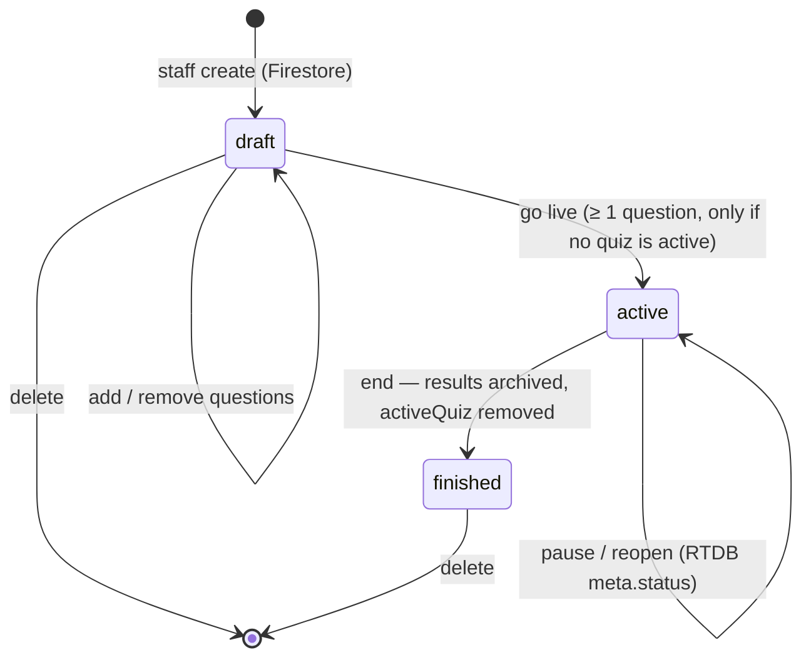
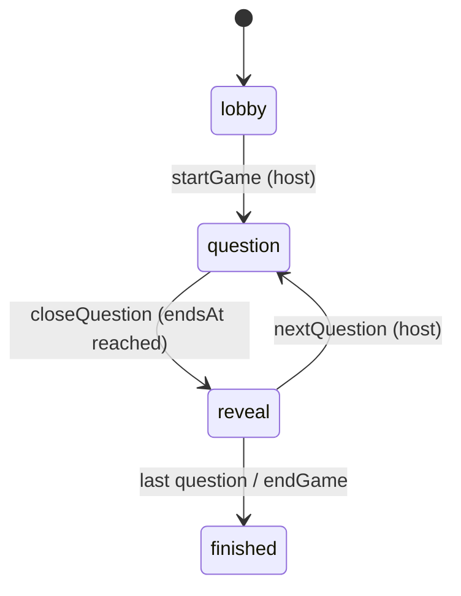

# Trivia App — Architecture

This document describes how the live multiplayer quiz described in [`description.md`](./description.md) is built on **Expo / React Native + React Native Firebase (RNFirebase v26, modular API)**.

The design follows the reference architecture in Ably's [Multiplayer quiz app architecture](https://ably.com/topic/multiplayer-quiz-app-architecture): a **host** drives the game, **players** answer from their own devices, and an **authoritative backend** owns game state, timing and scoring. Where that article uses Ably channels, presence and a Node quiz server, this app uses **Firebase Realtime Database (RTDB)**, **Cloud Functions for Firebase** and **Firebase Auth**.

> **Status markers.** ✅ *Built* — in the app today. 🟡 *Planned* — designed here, not implemented yet. Anything unmarked describes the current design.

---

## 1. Principles

1. **The server is the source of truth.** Clients never decide what question is live, when time runs out, whether an answer is correct, or what anyone's score is. They read state and submit intents. (Until Cloud Functions exist, staff clients and security rules stand in for the server — see §5.)
2. **Sync state, not events.** RTDB syncs *documents*. A client that reconnects just re-reads the current game state — there are no missed messages to replay.
3. **Server time, not device time.** Deadlines and timestamps are server timestamps. Clients convert with the RTDB server clock offset, so every phone shows the same countdown.
4. **Correct answers never reach a client before the reveal.** The answer key lives only where clients cannot read it.
5. **Keep fan-out linear.** Players subscribe to small, aggregated nodes (game meta, their own row, the leaderboard), never to each other's answers.
6. **One live quiz at a time, one quiz per player.** Staff create quizzes whenever they like; only one runs at a time. A player takes part in exactly one quiz, ever.
7. **Firestore holds everything durable; the Realtime Database holds only what is live.** Quizzes, players and results live in Firestore. The running quiz lives in RTDB under `activeQuiz/` and is removed when it ends.

---

## 2. Mapping the Ably reference to Firebase

| Ably reference architecture | This app (Firebase) |
|---|---|
| Node.js quiz server (worker per room) | Stateless **Cloud Functions** 🟡. The running quiz is data (`activeQuiz/`); until functions exist, staff clients perform host actions and rules enforce who may write what. |
| Host admin channel — start / next question | Staff (admin / moderator) create quizzes, start one, pause/reopen and end it ✅; question flow via callable functions 🟡. |
| Quiz broadcast channel — questions, answers, timer ticks | Read-only RTDB nodes under `activeQuiz/` (meta, current question 🟡, reveal 🟡, leaderboard ✅). No timer ticks — clients compute the countdown from `endsAt` 🟡. |
| Per-player answer channel | Write-once `activeQuiz/answers/{questionId}/{uid}`, validated by rules ✅ (rules only; answer UI 🟡). |
| Room join (by code) | **No codes.** A player joins **the active quiz** from the home screen; rules allow it only if they never joined a quiz (`joinedQuiz/{uid}`) ✅. |
| Presence set | `onDisconnect()` + `.info/connected` 🟡. |
| Token auth | **Firebase Auth**: name-only player accounts + email/password staff accounts; roles from the player entry and from custom claims ✅. |
| Multi-region edge routing | RTDB instance + Functions in **`europe-west1`**. Fairness via a server-side lead-in and server-timestamped answers 🟡. |
| Auto-reconnect, ordering, delivery | RTDB SDK auto-reconnects and resyncs the latest state; late queued writes are rejected by rules. |

---

## 3. System overview



### Which Firebase product does what

| Product | RNFirebase package | Used for |
|---|---|---|
| **Auth** | `@react-native-firebase/auth` | ✅ Name-only **player** accounts (email + password derived from the name) and email/password **staff** accounts. Staff roles are the `role` custom claim. Session restore is verified with the server on launch. |
| **Realtime Database** | `@react-native-firebase/database` | ✅ The active quiz only (meta, players, answers, leaderboard) and each player's one-quiz lock `joinedQuiz/{uid}`. 🟡 Current question, reveal, presence, server clock offset. |
| **Firestore** | `@react-native-firebase/firestore` | ✅ Players (`players/{uid}`, which also stores the player's role), quizzes (`quizzes/{quizId}`) and finished-quiz results (`quizzes/{quizId}/results/{uid}`). 🟡 Questions and answer keys. |
| **Cloud Functions** | `@react-native-firebase/functions` | 🟡 Authoritative question flow and scoring (separate `functions/` workspace). |
| **Remote Config** | `@react-native-firebase/remote-config` | 🟡 Client tunables and feature flags (§9). |
| **App Check** | `@react-native-firebase/app-check` | 🟡 Blocks scripted clients from functions and database writes. |

There is **no `users` collection**.

---

## 4. Identity, roles and days ✅

### 4.1 Accounts

| Kind | Created from | Credentials | Firestore / RTDB records |
|---|---|---|---|
| **Player** | Player page (app landing) — name only | Email + password derived from the name with SHA-256 (`features/auth/playerCredentials.ts`); the same name always yields the same account | `players/{uid}` (Firestore), written at creation; `joinedQuiz/{uid}` (RTDB) when they join a quiz |
| **Staff / observer** | 1. An **admin invites** them (home → Staff → name, email, role) → an invitation with an 8-character code, shared by the admin. No login yet. 2. The person enters **email + code** ("Staff sign in" → "Create your login"); the invitation is opened by its code and the email checked. 3. They choose a **password**; the login is created and the invitation **claimed** (copied to `{collection}/{uid}`, then deleted). | Real email + password | Invitation `{collection}/{code}` → active entry `{collection}/{uid}` in `admins/`, `moderators/` or `observers/` (Firestore) + `staffByEmail/{emailKey}` `{ role }` (RTDB, written by the admin) |

Players are created with `continueAsPlayer`: sign in to the derived account, or create it the first time. Creation writes the Firestore entry `players/{uid}`; if that fails, the new Auth account is deleted again so the player can retry. Signing in to an existing account re-creates a missing entry (older accounts, interrupted creations).

⚠️ Changing the derivation constants in `playerCredentials.ts` changes every player's credentials. The name is effectively the password: anyone entering the same name plays as that player.

### 4.2 Roles

Roles: `player`, `observer`, `moderator`, `admin` (`types/account.ts`). The app resolves the role in this order (`features/auth/userRole.ts`):

1. the **`role` custom claim** on the Auth token (set with the Admin SDK — how staff get their role, and how a player is promoted);
2. the **active staff entry** `admins/{uid}`, `moderators/{uid}` or `observers/{uid}` (the collection is the role), claimed from an admin's invitation. RTDB rules can't read Firestore, so the role is also mirrored as `{ role }` in RTDB `staffByEmail/{emailKey}` (`.` → `,`), written by the admin with the invitation;
3. the **`role` in the player's own entry** (`players/{uid}`, always `player`);
4. otherwise **`observer`**.

What each role may do (`features/auth/permissions.ts`, UI gating; rules enforce the same on the server):

| Role | Join the active quiz | Create quizzes / run the active one | Sign out |
|---|---|---|---|
| player | ✓ (one quiz, ever) | – | ✓ *(temporary)* |
| observer | watch only | – | ✓ |
| moderator | watch | ✓ | ✓ |
| admin | watch | ✓ | ✓ |

### 4.3 One quiz per player

A player may join **one quiz in their lifetime**. Joining writes `joinedQuiz/{uid}` `{ quizId, joinedAt }` in the same atomic update as the player and leaderboard entries; the rules only accept it when no such record exists and the quiz id is the active one. The record is never deleted, so it outlives the quiz and blocks joining any later one. It lives in RTDB (not Firestore) because RTDB rules can't read Firestore.

---

## 5. Data model

### 5.1 Realtime Database ✅

RTDB holds **only the live quiz** (plus the small records its rules need). Everything durable is in Firestore.

```text
/staffByEmail/{emailKey}                 # { role } mirror of the staff entry (rules can't read Firestore)

/joinedQuiz/{uid}                        # write-once, in the join update; never deleted
  quizId, joinedAt (server ts)           # the one quiz this player joined

/activeQuiz                              # exists only while a quiz runs; removed when it ends
  meta/                                  # staff create once (only if none exists); later only `status` changes
    quizId, title, questionCount (≥ 1), status: "open" | "closed", startedBy (uid), startedAt (server ts)
  players/{uid}/                         # joined players; only with a matching joinedQuiz/{uid} written in the same update
    id, displayName, joinedAt (server ts)
  answers/{questionId}/{uid}/            # write-once, joined players, quiz open; readable only by the author
    option, answeredAt (server ts)
  leaderboard/{uid}/                     # created at 0 on join (same atomic update); scores written by staff / functions
    id, displayName, score, correctCount

  # 🟡 planned for the question flow
  state/        phase, questionIndex, questionId, startsAt, endsAt, version
  currentQuestion/  id, index, text, options[], optionCount, durationMs   (no correct answer)
  reveal/       questionId, correctOption, distribution[]
```

Why this shape:

- **One node, one active quiz.** `activeQuiz/meta` can only be created when it doesn't exist, so the database itself refuses a second concurrent quiz.
- **Eligibility lives in RTDB.** RTDB rules cannot read Firestore, so the one-quiz lock is `joinedQuiz/{uid}`; the join and answer rules check it directly.
- **Narrow subscriptions.** Home subscribes to `activeQuiz/meta` and the account's `joinedQuiz/{uid}/quizId`; the game screen adds `leaderboard`. Nothing a player subscribes to grows with the number of answers.
- **Answers are isolated** so rules can hide them (RTDB read grants cascade, so there is no `.read` on `activeQuiz` for players).

### 5.2 Firestore

```text
admins/{id}, moderators/{id}, observers/{id}      one collection per staff role (the collection is the role)
  {code}  invitation (8 chars)          ✅ { id: code, email, displayName, role, createdBy, createdAt }        created by an admin
  {uid}   active entry                  ✅ { id: uid, email, displayName, role, createdBy, createdAt, invitationId }   claimed by the person

players/{uid}                            ✅ { id, displayName, role: "player", createdAt }

quizzes/{quizId}                         ✅ { id, title, status: "draft" | "active" | "finished", createdBy, createdAt,
                                              startedAt, endedAt, questionCount, playerCount }
quizzes/{quizId}/results/{uid}           ✅ { id, displayName, score, correctCount, rank }   archived when the quiz ends
quizzes/{quizId}/questions/{qId}         ✅ { id, order, text, options[2..4] }         editable only while draft
quizzes/{quizId}/answerKey/{qId}         ✅ { correctOption }                  kept apart so questions can later be copied
                                                                                to players without the answer
```

Types for every entity live in `src/types/`, grouped by domain (`account.ts`, `game.ts`, `quiz.ts`, `history.ts`) — see `AGENTS.md`.

---

## 6. Game lifecycle

### 6.1 Quizzes and the active quiz (✅ built)



1. A moderator or admin creates quizzes on **Quizzes** (home → Quizzes) at any time: `quizzes/{quizId}` with `status: "draft"`, then lands on the quiz's screen (`/quizzes/{quizId}`).
2. While it's a draft they **add questions** (text, 2–4 options, the correct one marked) and **remove** them. Each change writes the question, its answer key and `questionCount` in one batch. They can also **delete** any quiz that isn't live (questions, answer key and results go too).
3. **Go live** (`startQuiz`, needs ≥ 1 question): checks `activeQuiz/meta`, creates it (the rules reject it if another quiz got there first), then sets the Firestore quiz to `active`. If Firestore fails, the live quiz is removed again.
4. Players see the live quiz (title, question count) on their home card; those who never joined a quiz tap **Join the quiz** → one atomic update writes `joinedQuiz/{uid}`, `activeQuiz/players/{uid}` and `activeQuiz/leaderboard/{uid}` (score 0).
5. Everyone sees the live leaderboard on `/game`; staff can pause (`closed`) and reopen. A paused quiz accepts no joins or answers.
6. **End** (`endQuiz`): reads the leaderboard, writes `quizzes/{quizId}/results/{uid}` and marks the quiz `finished` (batched, quiz last, so retrying is safe), then removes `activeQuiz`. The next quiz can start.

### 6.2 Question flow (🟡 planned)

Within an open game, a question state machine runs on the server:



Every transition is a Cloud Function running an RTDB **transaction on `state`** that checks the expected `phase` and `version`, so duplicate calls are no-ops.

| Function | Type | Who | What it does |
|---|---|---|---|
| `startGame()` | callable | staff (claim checked) | `lobby → question` for question 0. |
| `nextQuestion()` | callable | staff | `reveal → question`, or `→ finished` after the last one. |
| `closeQuestion({ questionId })` | task queue + callable | server / host | Rejects if `now < endsAt`; reads answers + answer key; writes `leaderboard`, `reveal`, `phase = reveal`. |
| `endGame()` | callable | staff | `→ finished`; archives results to Firestore (for now done by the host app, see 6.1). |
| `setRole({ uid, role })` | callable | admin | Sets the `role` custom claim. |

**startQuestion:** load the question (not the answer key), write `currentQuestion`, set `state = { phase: "question", startsAt: now + LEAD_IN_MS, endsAt: startsAt + durationMs }`, enqueue `closeQuestion` at `endsAt + GRACE_MS`. `LEAD_IN_MS` (~1500 ms) lets the question reach every device before the clock starts. The host app also calls `closeQuestion` when its countdown hits zero; whichever arrives first wins.

### 6.3 Scoring (🟡 planned)

Computed only in `closeQuestion`, from server-stamped `answeredAt`:

```text
elapsed = clamp(answeredAt − startsAt, 0, durationMs)
points  = correct ? round(1000 × (1 − 0.5 × elapsed / durationMs)) : 0
```

A correct answer is worth 500–1000 points; faster is better. During a question the live signal is the answered count, never correctness; the leaderboard moves at each reveal.

---

## 7. Client architecture

### 7.1 Setup ✅

RNFirebase contains native code, so the app runs in a **development build**, not Expo Go. Native config comes from config plugins in `app.json` (`@react-native-firebase/app`, `auth`, `app-check`, `expo-build-properties` with `useFrameworks: "dynamic"`). The Firebase config files live in `config/firebase/` (EAS builds read them from file env vars, see `app.config.js`). The RTDB URL is set explicitly in `services/firebase/index.ts` because the config files don't carry it.

**Web** ✅ runs the same code: React Native Firebase runs on the Firebase JS SDK in the browser. `services/firebase/index.web.ts` (picked by Metro on web) initializes the default app from `config/firebase/firebaseWebConfig.ts` (the console's web app config; git-ignored like the native config files: copy `firebaseWebConfig.example.ts` and fill it in). Sessions persist like on phones: React Native Firebase creates web Auth without persistence (in-memory, so a reload would sign out), so `metro.config.js` swaps its internal `…/internal/web/firebaseAuth` module for `services/firebase/webAuthPersistence.ts`, which gives `initializeAuth` IndexedDB/localStorage persistence (web bundles only; re-check after upgrading React Native Firebase). On web, React Native Firebase runs **Firestore Lite** (reads and writes, no real-time listeners). The app doesn't need them: staff screens deliberately don't follow Firestore live on any platform. `services/firebase/loadedQuery.ts` (`loadQuery`) reads a query when the screen opens and again right after this device writes (`refreshLoadedQueries`); changes by other staff show on the next open. The Realtime Database has full listeners on web, so the live quiz is real-time everywhere. Native-only UI goes through a `.web.ts` counterpart, e.g. `utils/confirm.ts` (`Alert`) / `confirm.web.ts` (`window.confirm`). The web build is a single-page app (`app.json` → `web.output: "single"`) served by **Firebase Hosting**: `npm run deploy:web` = `expo export --platform web` (→ `dist/`) + `firebase deploy --only hosting`; `firebase.json` rewrites every path to `/index.html` and caches the hashed bundles for a year.

Always use the **modular API**. Known RNFirebase pitfall: `doc()` cannot take a `DocumentReference` as parent at runtime — build paths from the root (`doc(firestore, 'players', day, 'users', id)`).

### 7.2 Folder structure ✅

```text
src/
  app/                              # Expo Router routes only
    _layout.tsx                     # Redux Provider, fonts, session + role + joined-quiz sync, auth guards
    create-player.tsx               # landing when signed out: name-only player creation (+ staff sign-in icon)
    sign-in.tsx, sign-up.tsx, forgot-password.tsx   # staff email accounts
    index.tsx                       # home: player bar, "Live quiz" card
    game.tsx                        # the active quiz: status, host controls, live leaderboard
    quizzes/index.tsx               # staff: create quizzes, list them
    quizzes/[quizId].tsx            # staff: add/remove questions, delete, go live
  features/
    auth/                           # session, roles, permissions, player credentials, player entries
      authSlice.ts                  # session state, sign-in/up/out, player entry, password reset, role
      userRole.ts, permissions.ts, playerCredentials.ts, playerDocuments.ts
      useAuthSession.ts, useUserRoleSync.ts, use*Form.ts
    quiz/                           # Firestore quizzes
      quizApi.ts                    # quizzes, questions + answer key, delete, mark active/draft, archive results
      quizSlice.ts, useQuizzesSync.ts, useQuizQuestionsSync.ts, useQuizEditor.ts
      useCreateQuizForm.ts, useAddQuestionForm.ts
      components/                   # QuizList, QuizStatusPill, QuestionList, AddQuestionForm
    game/                           # the active quiz (RTDB)
      gameSlice.ts                  # active quiz state, joined quiz, start/join/status/end requests
      gameApi.ts                    # RTDB commands + subscriptions for activeQuiz and joinedQuiz
      standings.ts                  # sorting, ranks, results for archiving
      useActiveQuizSync.ts, useJoinedQuizSync.ts, useActiveQuiz.ts
      components/                   # ActiveQuizCard, LeaderboardList, StatusPill
  components/                       # shared UI (Button, TextField, GameCard, Avatar, …)
  services/firebase/                # auth / firestore / database instances; RTDB path builders
  store/                            # configureStore, typed hooks
  types/                            # entity types grouped by domain (account.ts, game.ts, quiz.ts, history.ts)
  utils/                            # calendarDay (date display), withTimeout, appErrors, confirm (+ .web)
config/firebase/                    # GoogleService-Info.plist, google-services.json, firebaseWebConfig.ts (all gitignored); firebaseWebConfig.example.ts
firestore.rules, firestore.indexes.json, database.rules.json, firebase.json (+ hosting)
functions/                          # 🟡 Cloud Functions workspace
```

### 7.3 Navigation ✅

**Expo Router**, one root `Stack` with `Stack.Protected` guards: signed out → `create-player` (first, so it is the landing), `sign-in`, `sign-up`, `forgot-password`; signed in → `index`, `game`; hosts also `quizzes/index` and `quizzes/[quizId]`, admins `staff/new`. The game screen renders by the active quiz's state instead of navigating per phase, so a reconnect simply re-renders whatever the server says.

Deep links use the `triviaapp://` scheme; `triviaapp://game` opens the active quiz. Do not use Firebase Dynamic Links (shut down).

### 7.4 State management (Redux Toolkit) ✅

- Firebase listeners live in hooks (Firestore queries are read, not followed live: `loadQuery`, see 7.1; `useAuthSession`, `useUserRoleSync`, `useJoinedQuizSync`, `useActiveQuizSync`, `useQuizzesSync`), never in components. They dispatch plain serialisable data; `DataSnapshot`, `User` or references never enter Redux.
- `auth` slice: session (`restoring` / `signedOut` / `signedIn`), role, request status and errors. The session listener defers during sign-in/up so the home screen appears only once the player records are written.
- `game` slice: `active` (`meta`, `leaderboard`, `isLoaded`), the account's `joinedQuizId`, request status (`start`, `join`, `status`, `end`) and errors. "Has joined" is `joinedQuizId === active.meta.quizId`.
- `quiz` slice: the staff quiz list, questions of the quiz being edited (`questionsByQuiz`), and the create / delete / add-question / remove-question requests.
- Subscriptions per screen: home → `activeQuiz/meta` (+ `joinedQuiz/{uid}` app-wide); game screen → also `leaderboard`; quizzes screens → Firestore `quizzes` (+ that quiz's `questions` and `answerKey` on its screen).

### 7.5 Server clock, countdown, presence, answers (🟡 planned)

- **Server clock:** `serverNow = Date.now() + .info/serverTimeOffset`; `remaining = state.endsAt − serverNow()`; countdown bar driven by Reanimated from `startsAt`/`endsAt`.
- **Presence:** on `.info/connected`, register `onDisconnect` then set `online: true` under `activeQuiz/players/{uid}`; a dropped player keeps their score.
- **Answering:** `set(activeQuiz/answers/{questionId}/{uid}, { option, answeredAt: serverTimestamp() })`; a rejected write shows "Time's up".

---

## 8. Security ✅

Rules are in the repo and deployed with `firebase deploy --only database,firestore:rules,firestore:indexes`. Cloud Functions (Admin SDK) bypass them.

### 8.1 Realtime Database (`database.rules.json`)

| Path | Read | Write |
|---|---|---|
| `staffByEmail/{emailKey}` `{ role }` | own (by login email); staff | admins |
| `joinedQuiz/{uid}` | own; staff | own, **once**, in the same update as joining; `quizId` must be the active quiz; `joinedAt == now` |
| `activeQuiz/meta` | signed in | staff; **create only if no quiz is active** (`startedBy == auth.uid`, `startedAt == now`, `questionCount ≥ 1`), later only `status` |
| `activeQuiz/players/{uid}` | signed in | own, once, quiz open, no earlier `joinedQuiz/{uid}`, and a matching `joinedQuiz/{uid}` in the same update; `joinedAt == now` |
| `activeQuiz/leaderboard/{uid}` | signed in | staff; the player may create their own entry at 0 in the same update as joining |
| `activeQuiz/answers/{q}/{uid}` | own; staff | own, once, only if joined and the quiz is open; `answeredAt == now` |
| `activeQuiz` (whole node) | staff | staff may only **delete** it (ending the quiz) |

Staff = `auth.token.role` is `admin` or `moderator`. Every node declares its fields; unknown fields are rejected.

### 8.2 Firestore (`firestore.rules`)

- `players/{uid}`: the owner may **create** once with exactly `id, displayName, role: "player", createdAt == request.time`, and read it; no updates or deletes by players.
- `quizzes/{quizId}` and `results/`: admins and moderators (the catch-all below).
- `admins/`, `moderators/`, `observers/{id}`: **invitations** (8-char code ids) are created by admins and can be opened (`get`, never `list`) by anyone who knows the code; the invited person may **claim** theirs — create `{uid}` copied from it, checked against their login's email, and delete it. Active entries are readable by their owner and staff; only **admins** update or delete.
- Everything else (including all of `players` for management, quizzes, results, future answer keys): **admins and moderators only**.

### 8.3 Anti-cheat summary

| Threat | Mitigation |
|---|---|
| Playing more than one quiz | `joinedQuiz/{uid}` is write-once, never deleted, and required (matching the active quiz) to join. *Residual:* a player could delete their account and recreate it under a new name. |
| Two quizzes at once | `activeQuiz/meta` can only be created when absent. |
| Raising your own role | Roles are custom claims (Admin SDK only); player entries can only be created with `role: "player"`. |
| Answering late / twice | Rules: game open, joined, write-once, `answeredAt == now` (server time). |
| Faking scores | Leaderboard entries start at 0; only staff (🟡 functions) write scores. |
| Seeing others' answers | `answers/{q}/{uid}` readable only by the author and staff. |
| Answer key leak | 🟡 Answer key only in Firestore `answerKey` (staff); copied to `reveal` after the question closes. |
| Guessing a staff invitation | 8-character codes from a secure random source (~8.5 × 10¹¹ combinations); invitations can be opened by id but never listed; a claim must match the login's email. |
| Guessing a player's name | Inherent to name-only accounts: the name is the credential. Staff use real email accounts. |
| Scripted clients | 🟡 App Check. |

---

## 9. Reliability and reconnection

- **Firebase calls that can hang** (writes waiting for a server acknowledgement) are wrapped in `withTimeout`; the user gets an error instead of an endless spinner. In development builds, error messages include the raw Firebase code.
- **Session restore** is verified with `reload()` on launch; deleted or disabled accounts are signed out with a notice. Offline launches keep the cached session.
- **Reconnect:** RTDB resyncs; the game screen re-renders from `activeQuiz/meta` / `leaderboard`. Queued late writes are rejected by rules.
- **Players without a `players/{uid}` entry** (created before it existed) get one when they next enter their name. Old `players/{day}/users/…`, `registrations/` and `games/` data is no longer read and can be deleted.
- **Ending a quiz half-way** (archive written, `activeQuiz` not removed) is safe to retry: results are overwritten and the quiz is only marked `finished` in the last batch.
- 🟡 Host drops: the Cloud Tasks safety net closes open questions; the game waits in `reveal` until the host returns.

---

## 10. Remote Config (🟡 planned)

Client-side tunables only (never scoring or security): `default_question_duration_ms`, `max_players_per_game`, `min_supported_app_version`, `feature_*` flags. Fetch-and-activate at startup with in-app defaults.

---

## 11. Development and testing

- Run `npx tsc --noEmit` and `npx expo lint` before merging (per `AGENTS.md`).
- 🟡 **Emulator Suite** (Auth, RTDB, Firestore, Functions) with `connect*Emulator` in `__DEV__`.
- 🟡 **Rules tests** with `@firebase/rules-unit-testing`: joining another day's game, double answers, late answers, raising a role, reading others' answers.
- 🟡 **Functions unit tests** for scoring and state transitions; a load test of one day's game at the target player count.

---

## 12. Scaling notes

- **Per quiz:** each answer write fans out only to its trigger; scores and the leaderboard are written once per question. Cost per question is O(players).
- **Per database instance:** ~200k concurrent connections and ~1,000 writes/second — ample for one active quiz.
- **Leaderboard size:** the game screen reads the whole `leaderboard` (and ending a quiz archives it in batches of 500); for very large days, switch to a top-N node written by `closeQuestion`.
- **Geography:** one RTDB region (`europe-west1`); fairness comes from the lead-in and server timestamps.

---

## 13. Implementation order

1. ✅ Firebase project, dev build, email/password Auth, name-only players, roles (claims + player entry), session verification.
2. ✅ Quizzes in Firestore, one active quiz in RTDB (start, pause/reopen, end + archive), one quiz per player, live leaderboard.
3. 🟡 Staff role management: Admin SDK script or `setRole` function.
4. ✅ Question editor (questions and answer keys under `quizzes/{quizId}`), delete quiz, go live.
5. 🟡 Question flow: `startGame` / `closeQuestion` / `nextQuestion`, server clock, countdown, answer UI, scoring, reveal.
6. 🟡 Final podium; move start/end/archive into Cloud Functions.
7. 🟡 Presence, Remote Config, App Check, emulators and rules tests, cleanup job.

---

### References

- Ably — [Multiplayer quiz app architecture](https://ably.com/topic/multiplayer-quiz-app-architecture)
- React Native Firebase — [Getting started / Expo](https://rnfirebase.io/), [Realtime Database presence](https://rnfirebase.io/database/presence-detection), [Modular API (v22+)](https://rnfirebase.io/migrating-to-v22)
